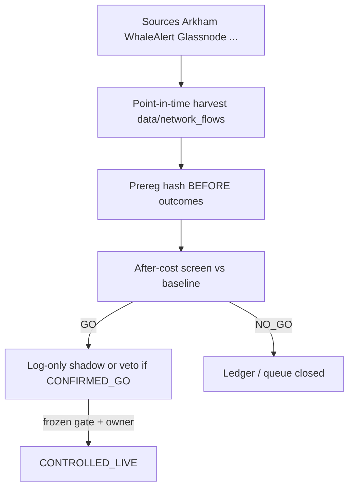

# Big-Move / Whale / Network Intelligence Sources → Bot Integration Path
*Generated: 2026-07-24 | Sources: 18 | Confidence: Medium–High on catalog; Low on after-cost futures edge*

## Executive Summary

Arkham-class tools (entity-labeled whale transfers, exchange inflows/outflows, dormant wakes, stablecoin mints) are real **data products**, not proven **after-cost futures alphas** for this bot. Academic work finds *some* return/volatility predictability in exchange netflows (especially ETH and USDT inflows), but retail single-alert chase is often priced in, and this repo already refuted **BTC-dominance & ETF-flow timing** plus **OI-divergence**. The bot already consumes a thin Binance Web3 “smart money inflow rank” as MCP **bonus B13** — not as authority. Honest integration = (1) catalog sources, (2) harvest **point-in-time** history under license, (3) pre-register **veto/regime** expressions (not chase-the-tweet entries), (4) screen after costs. **No live strategy wiring from this research alone.**

## Binding ledger / local context

| Family | Status | Implication |
|--------|--------|-------------|
| BTC-dominance & ETF-flow timing | REFUTED NO_EDGE (2026-06-07) | Do not rebrand ETF/dominance timing as “Arkham edge” |
| OI-divergence | REFUTED; gates disabled | Futures OI spikes ≠ authorized alpha |
| Network / exchange-flow (scout 26) | OPEN / INSUFFICIENT_DATA | Needs PIT harvest before any screen |
| Smart money bonus B13 | Already in `mcp_brain` (+5 if top-20 Binance Web3 inflow on buys) | Rank snapshot only; 15m cache; **not** entity-labeled whale ledger |

Local feed: [`core/data_feeds/smart_money_feed.py`](core/data_feeds/smart_money_feed.py) → Binance Web3 inflow + social hype ranks. Wired via `data_coordinator` / MCP B13.

## 1. Source catalog (Arkham-like “big movements”)

### Tier A — Entity / whale transfer intelligence

| Source | What it gives | API / access | Fit for this bot |
|--------|---------------|--------------|------------------|
| **[Arkham Intel](https://intel.arkm.com/api/docs)** | Entity-labeled addresses, transfers, volume, alerts, WS transfers ([llms.txt](https://arkm.com/llms.txt); API relaunch Feb 2026 ([announcement](https://info.arkm.com/announcements/the-new-arkham-api))) | Paid / request access; credit pricing | Best entity graph; **no free PIT archive locally** → INFEASIBLE until key + harvest rights |
| **[Whale Alert](https://developer.whale-alert.io/api-account/documentation)** | Large transfers, exchange attribution, stablecoin mint/burn, WS | Paid developer (~$30+/mo alerts; enterprise for history); free UI is thin | Good event stream; history short on cheap tiers |
| **Nansen** | Smart-money labels, netflows, EVM-heavy | Commercial | Strong labels; cost vs $420 account disproportionate until edge proven |
| **Lookonchain / similar X feeds** | Narrative whale posts | No clean API / not PIT | Unfit for reproducible screen |

Arkham’s own research framing for alerts ([Crypto Alerts…](https://info.arkm.com/research/crypto-alerts-transfers-whale-activity-trading-push)): exchange inflow/outflow, dormant activation, stablecoin minting — **descriptive playbook**, not an after-cost OOS study for USDT-M perps.

### Tier B — Aggregate exchange flow / on-chain metrics

| Source | What it gives | API | Fit |
|--------|---------------|-----|-----|
| **Glassnode** | Exchange balances, whale cohorts, MVRV/NUPL-class metrics | Paid | Daily/slow regime; needs PIT + license |
| **CryptoQuant** | Exchange netflow, miner, stablecoin | Mostly paid API | Same |
| **CoinGlass** | Spot/futures netflow lists ([docs](https://docs.coinglass.com/reference/spot-netflow-list)) | Paid (Startup+) | Futures-adjacent; still commercial |
| **Santiment** | Flows + social | Paid | Overlaps social-hype already in Binance feed |

### Tier C — Already free / local (use first)

| Source | Status |
|--------|--------|
| Binance Web3 smart-money + social hype ranks | **Live** in bot (B13 bonus + crowd size-down) |
| Venue funding / OI caches | Local; directional funding & OI-divergence **refuted** — keep for F1/risk only |
| AggTrades / VPIN path | Queued as **jump-risk veto** (not whale) — still ahead of network in queue |

## 2. What external evidence actually supports

**Supportive (predictability ≠ retail futures EV):**

- Cross-exchange BTC/ETH flows Granger-predict each other; large venues dominate ([Hanyang thesis PDF](https://repository.hanyang.ac.kr/bitstream/20.500.11754/167238/1/Informational%20Content%20of%20Exchange%20Flows%20in%20Cryptocurrency%20Markets.pdf)).
- ETH net inflows negatively forecast ETH returns/vol at 1–6h; USDT exchange inflows positively forecast BTC/ETH returns at short horizons; BTC netflows weak except ~4h ([arXiv 2411.06327](https://arxiv.org/pdf/2411.06327) / [SSRN 4630115](https://papers.ssrn.com/sol3/papers.cfm?abstract_id=4630115)).
- Broader **order flow** (not Arkham entities) has OOS predictive power with cost robustness claimed in EFMA 2025 paper ([Order Flow and Cryptocurrency](http://www.efmaefm.org/0EFMAMEETINGS/EFMA%20ANNUAL%20MEETINGS/2025-Greece/papers/OrderFlowpaper.pdf)) — closer to tape/VPIN family than whale tweets.

**Adverse / caution:**

- Single Whale Alert tweets are often **late** once retail sees them ([Cryptint](https://cryptint.io/declassified/whale-tracking/exchange-inflow-outflow)).
- Vendor blogs citing “73% of the time” outflow→return ([LedgerMind](https://theledgermind.com/exchange-flow-analysis-crypto/)) — **unverified**; do not treat as reopen bar.
- Hourly BTC strategies die under 10 bps without cost-aware filters ([arXiv 2606.00060](https://arxiv.org/abs/2606.00060)).
- This bot’s **ETF/dominance timing** already NO_EDGE.

**Inference (labeled):** Best research expression for *this* stack is **slow exchange-netflow / USDT-inflow as regime or entry veto**, or **entity whale→exchange as rare event flag** — not high-frequency chase of Arkham alerts into AccBand.

## 3. Integration policy (evidence pipeline — binding)

### Already integrated (do not duplicate)

- Smart-money **rank bonus** B13 and social-hype size risk in MCP — keep as bonus; do **not** escalate to required gate without a screen GO.

### Queued candidates (NEW briefs — expectation NO_GO / INSUFFICIENT_DATA)

See [`31_candidate_queue_whale_network_2026-07-24.md`](31_candidate_queue_whale_network_2026-07-24.md).

1. **N1 — Exchange netflow regime veto (BTC/ETH)** — ADJACENT to network OPEN; veto AccBand OPEN on extreme exchange *inflow* spikes (distribution risk). Needs hourly PIT netflow series.
2. **N2 — USDT exchange-inflow risk flag** — literature-aligned short-horizon return association; express as size-down / veto, not mandatory long.
3. **N3 — Whale→CEX entity transfer event (Arkham/Whale Alert)** — rare event; log-only shadow first; filter internal exchange reshuffles.

### Explicit STOP / refuse

- Wiring Arkham/Nansen as live entry authority without prereg+screen.
- “Follow whale alert tweet → market long/short” scalps (priced-in + fee death).
- Reopening ETF/dominance/OI rows via whale marketing.

### Blockers before any screen

1. **Licensed API key** (Arkham request access, or Whale Alert / CoinGlass / CryptoQuant).
2. **Point-in-time archive** with availability timestamp + entity-label revision policy under `data/network_flows/` (gitignored).
3. **One heavy stage per UTC day** — VPIN veto remains ahead in [`30_edge_queue_2026-07-23.md`](30_edge_queue_2026-07-23.md); network waits until VPIN closes or owner reorders.

## Key Takeaways

1. **Sources exist** (Arkham, Whale Alert, Nansen, Glassnode, CryptoQuant, CoinGlass) — mostly **paid**, entity quality varies.
2. **Bot already has** a free Binance Web3 smart-money bonus — weak proxy, not Arkham.
3. **Evidence supports research interest** in exchange/USDT flows; **does not** authorize live installs or reopen refuted ETF/OI families.
4. **Integrate via pipeline only:** harvest → prereg → after-cost screen → log-only veto/shadow if GO.
5. **Owner action to unblock N1–N3:** choose and fund one data vendor; until then status stays INSUFFICIENT_DATA / INFEASIBLE-at-current-budget.

## Sources

1. [Arkham API docs](https://intel.arkm.com/api/docs) — Intel API guide.
2. [Arkham llms.txt](https://arkm.com/llms.txt) — endpoint map (transfers, alerts, WS).
3. [New Arkham API (Feb 2026)](https://info.arkm.com/announcements/the-new-arkham-api).
4. [Arkham Intel product](https://info.arkm.com/arkham-intel-api).
5. [Arkham alert playbook](https://info.arkm.com/research/crypto-alerts-transfers-whale-activity-trading-push).
6. [Whale Alert API](https://developer.whale-alert.io/api-account/documentation).
7. [Whale Alert FAQ pricing](https://whale-alert.io/faq.html).
8. [CoinGlass spot netflow API](https://docs.coinglass.com/reference/spot-netflow-list).
9. [Nansen whale forecasting guide](https://www.nansen.ai/post/forecasting-crypto-trends-5-proven-strategies-for-predicting-whale-movements).
10. [Nansen token flow guide](https://www.nansen.ai/post/how-to-effectively-use-onchain-data-for-token-flow-research-a-comprehensive-guide).
11. [Altrady Nansen/Glassnode/Santiment guide](https://www.altrady.com/crypto-trading/onchain-blockchain-analytics-for-traders/how-to-use-nansen-glassnode-santiment).
12. [LedgerMind exchange flow 2026](https://theledgermind.com/exchange-flow-analysis-crypto/) — vendor narrative; treat cautiously.
13. [Cryptint inflow/outflow](https://cryptint.io/declassified/whale-tracking/exchange-inflow-outflow) — alert latency warning.
14. [Hanyang exchange-flow predictability](https://repository.hanyang.ac.kr/bitstream/20.500.11754/167238/1/Informational%20Content%20of%20Exchange%20Flows%20in%20Cryptocurrency%20Markets.pdf).
15. [arXiv 2411.06327 on-chain flows](https://arxiv.org/pdf/2411.06327).
16. [SSRN 4630115](https://papers.ssrn.com/sol3/papers.cfm?abstract_id=4630115).
17. [EFMA 2025 Order Flow and Cryptocurrency](http://www.efmaefm.org/0EFMAMEETINGS/EFMA%20ANNUAL%20MEETINGS/2025-Greece/papers/OrderFlowpaper.pdf).
18. Local: ledger; `smart_money_feed.py`; MCP B13; scout `26_*`; edge queue `30_*`.

## Methodology

Sub-questions: (1) Which vendors supply Arkham-like big-move data? (2) What APIs/costs/history exist? (3) What peer-reviewed predictability exists after costs? (4) What does this bot already wire? (5) What evidence-gated integration is allowed?

Firecrawl/Exa MCP unavailable; used web search + full fetches (Arkham, Whale Alert docs, arXiv/SSRN PDFs via fetch). Cross-checked against refuted-families ledger and local feeds.
